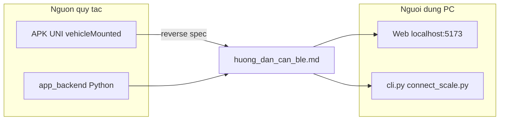

# Hướng dẫn cân BLE — Quy tắc kỹ thuật & tính năng

Tài liệu dùng cho **app_backend** (quét/kết nối cân BLE trên Windows).  
Gồm quy tắc protocol (trích từ app nhà cung cấp) và hướng dẫn thao tác cho người dùng.

---

## Phần A — Tổng quan

### Mục đích

- Quét thiết bị BLE quanh PC (không ghép đôi Bluetooth Classic trong Cài đặt Windows).
- Kết nối GATT tới cân/module JS, đọc khối lượng (kg) realtime qua web hoặc CLI.

### Phạm vi thiết bị

| Dấu hiệu | Ý nghĩa |
|----------|---------|
| Tên Bluetooth bắt đầu **`JS`** | Lọc trong app mobile UNI (`utils/bluetooth.js`) |
| Service **`ffe0`** (vendor) | Kênh dữ liệu phổ biến trên cân dòng JS |
| Characteristic **`ffe1`** | Notify — nhận gói dữ liệu |
| Characteristic **`ffe2`** | Write — gửi lệnh (đo, điện áp, nhiệt…) |

**Ví dụ đã probe:** MAC `AB:0B:BE:93:8C:29`

- `[2] ffe0` — notify + write (`ffe1`, `ffe2`)
- `[3] 180a` — Device Information (chỉ read; **không** phải kênh đo)

### Nguồn quy tắc — quan trọng

| Loại | Nguồn | Ghi chú |
|------|--------|---------|
| Công thức kg, frame 7 byte | APK UNI `parseHexToType` — `pages/indexNew/indexNew.vue` | **Không** phải chuẩn Bluetooth SIG (`0x181D` / `0x2A9D`) |
| Lệnh BLE write | `getWeight`, `getVoltage`, `setTemperature`, `valueToHexCommand` | Trích từ `app-service.js` |
| Kết nối GATT | `utils/bluetooth.js` | `services[3]`, MTU 512 |
| Code PC | `app/weight_parser.py`, `app/ble_profiles.py`, `app/scale_client.py` | Mặc định `WEIGHT_PARSER=uni_js_only` |

**Lưu ý:** Nhà cung cấp **chưa gửi** file PDF/SDK protocol riêng trong gói zip. Tài liệu này **suy ra từ app** `vehicleMounted` (`__UNI__62E474F`), không phải tài liệu hãng chính thức.



---

## Phần B — Quy tắc BLE chi tiết

### B.1 Discovery và nhận diện

**App mobile UNI**

- Quét BLE, chỉ chọn thiết bị có `device.name.startsWith("JS")`.

**app_backend (PC)**

- `NAME_HINTS` trong `.env` — mặc định gồm `JS`, `Jinlyun`, `Scale`, …
- `SERVICE_HINTS` — mặc định `181d`, `fff0`, `ffe0`, `2a9d`
- Cột **「Gợi ý cân」** trên web khi tên hoặc service UUID khớp.

**Xác nhận đúng thiết bị**

1. Bật cân → quét 15–20 giây → ghi **MAC**.
2. Tắt cân → quét lại → MAC **biến mất** → khả năng cao là đúng thiết bị.

---

### B.2 Kết nối GATT

**Luồng app UNI** (`utils/bluetooth.js`)

| Bước | Hành vi |
|------|---------|
| 1 | `openBluetoothAdapter` |
| 2 | `startBluetoothDevicesDiscovery` |
| 3 | `createBLEConnection` |
| 4 | `setBLEMTU({ mtu: 512 })` |
| 5 | `getBLEDeviceServices` → **`serviceId = services[3].uuid`** |
| 6 | Chọn char **notify** / **write** theo `properties` |
| 7 | `notifyBLECharacteristicValueChange` |
| 8 | `onBLECharacteristicValueChange` → `ab2hex` → `parseHexToType` |

**Profile trên PC** (`POST /api/scale/connect`)

| Profile | Khi nào dùng |
|---------|----------------|
| **`auto`** (mặc định) | Nếu `services[3]` có notify+write → `uni_compat`; ngược lại → `uuid` |
| **`uuid`** | Cân có **`ffe0`** ở index khác 3 (vd. index 2) — **khuyến nghị** cho MAC `AB:0B:BE:…` |
| **`uni_compat`** | Chỉ khi service index 3 có notify + write (không phải `180a` read-only) |

**Wake command sau kết nối**

- PC gửi `UNI_WAKE_COMMANDS` qua char **write** (`ffe2` nếu không có `ffe3`).
- Lệnh được gửi tự động khi kết nối; không cần thao tác thủ công trên web.

---

### B.3 Bảng lệnh write (từ APK)

Chuỗi hex → `hexToBuffer` → `sendData` (ghi characteristic write).

| Hàm UNI | Hex (6 byte) | Mục đích | PC đã gửi? |
|---------|----------------|----------|------------|
| `getWeight` | `05 A9 00 00 00 AE` | Yêu cầu khối lượng | Có |
| `getVoltage` | `05 C4 00 00 00 C9` | Điện áp (ước lượng pin) | Có |
| `getTemperature` | `05 C5 00 00 00 CA` | Nhiệt độ | Có |
| Cấu hình nhiệt | `05 CA 00 00 00 CF` | Giới hạn / cấu hình | Chưa |
| Cấu hình nhiệt | `05 CA 00 00 01 D0` | Giới hạn / cấu hình | Chưa |
| Khác | `05 A6 00 00 00 AB` | Cấu hình thiết bị | Chưa |
| Khác | `05 85 00 00 01 8B` | Cấu hình thiết bị | Chưa |

Lệnh ngưỡng cân (`weightUpper` / `weightLower`) dùng `valueToHexCommand()` — **chỉ có trong app mobile**, PC chưa triển khai.

---

### B.4 Quy tắc giải mã notify (`parseHexToType`)

**Điều kiện:** chuỗi hex **đúng 14 ký tự** (= 7 byte), bỏ khoảng trắng.

**Sơ đồ byte**

```text
Byte:  [0] [1] [2] [3] [4] [5] [6]
Hex:   ..  40  00  00  00  64  ..
       |   |   |---- value 4 byte BE ----|
       |   loại: 40=kg, 50=kg âm, 00=lỗi
```

**Khối lượng** (hex vị trí 2–3 ∈ `40`, `50`, `00`)

```text
value = parseInt(hex[4:12], 16)    # 8 ký tự hex, big-endian
kg    = 10 × value / 1000
```

- `50` → `kg = -kg`
- `00` → lỗi, không trả kg hợp lệ
- Làm tròn 2 chữ số thập phân

**Điện áp** — khi `hex[4:8].toUpperCase() == "C400"`:

```text
V = parseInt(hex[8:12], 16) / 100
```

**Nhiệt độ** — khi `hex[4:8].toUpperCase() == "C500"`:

```text
°C = parseInt(hex[8:12], 16) / 10
```

**Ví dụ số**

| raw_hex (7 byte) | value | kg |
|------------------|-------|-----|
| `00400000006400` | 100 | **1.0** |
| `004000001b5800` | 7000 | **70.0** |

**Lỗi parser cũ (đã sửa):** frame `00400000006400` từng bị `ffe_salter` đọc thành **25.6 kg** (sai ~25×). PC mặc định `WEIGHT_PARSER=uni_js_only` — chỉ dùng công thức UNI.

**Cấu hình parser** (`.env`)

```env
WEIGHT_PARSER=uni_js_only   # mặc định — chỉ uni_js_weight / voltage / temperature
WEIGHT_PARSER=auto          # thử thêm ffe_qn, chipsea, generic (nhiều loại cân khác)
```

---

### B.5 Mapping code Python

| Spec UNI | File / hàm Python |
|----------|-------------------|
| `parseHexToType` | `app/weight_parser.py` → `parse_uni_hex_string`, `parse_uni_notify` |
| `ab2hex` + 7 byte | `bytes_to_hex_string(data[:7])` |
| `getWeight` | `app/ble_profiles.py` → `UNI_CMD_GET_WEIGHT` |
| Wake khi connect | `app/scale_client.py` → `UNI_WAKE_COMMANDS` qua `ffe2`/`ffe3` |
| Profile connect | `app/scale_client.py` → `auto` / `uuid` / `uni_compat` |
| GATT map + index | `app/gatt_map.py`, `GET /api/scale/gatt-map` |

**Trường `source` trên WebSocket / UI**

| source | Ý nghĩa |
|--------|---------|
| `uni_js_weight` | Khối lượng — công thức UNI |
| `uni_js_voltage` | Điện áp (parser có, UI chưa hiển thị riêng) |
| `uni_js_temperature` | Nhiệt độ (parser có, UI chưa hiển thị riêng) |

---

## Phần C — Ma trận tính năng cân

So sánh **app mobile UNI** (`vehicleMounted`) và **app_backend PC**.

| # | Tính năng | App UNI | PC app_backend | Hướng dẫn người dùng PC |
|---|-----------|---------|----------------|-------------------------|
| 1 | Quét thiết bị BLE | Có | **Có** (web / CLI) | Bật cân → **Bắt đầu quét** 15–20s |
| 2 | Gợi ý / lọc cân | Tên `JS…` | **Có** (`likely_scale`) | Xem cột 「Gợi ý cân」 |
| 3 | Xem GATT (services) | — | **Có** (nút **GATT**) | Kiểm tra `ffe0`, index `[3]` |
| 4 | Kết nối cân | Có | **Có** + chọn profile | `auto` hoặc `uuid` cho ffe0 |
| 5 | Đọc khối lượng (kg) | Có | **Có** (realtime WS) | Kết nối → đặt tải → đợi ổn định |
| 6 | Xem gói thô (debug) | Log nội bộ | **Có** (`raw_hex` trên UI) | Khi chưa có kg hoặc cần báo NCC |
| 7 | Điện áp / pin | `getVoltage` | Parser có, **UI chưa** | Dự kiến bổ sung hiển thị |
| 8 | Nhiệt độ | `getTemperature` | Parser có, **UI chưa** | Dự kiến bổ sung hiển thị |
| 9 | Ngưỡng cân trên/dưới | `weightUpper` / `weightLower` | **Chưa** | Chỉ app mobile + APK |
| 10 | Ngưỡng nhiệt | `temperatureUpper` | **Chưa** | Chỉ app mobile |
| 11 | Đăng nhập / cloud | `manageWeb` | **Không** | Cần APK + tài khoản server NCC |
| 12 | Cảnh báo / ID binding | pages warning, binding | **Không** | Chỉ app mobile |
| 13 | Lưu lịch sử cân | SQLite `addSQLdata` | **Không** | Chỉ app mobile |

**Dùng được ngay trên PC:** hàng **1–6**.  
**Biết có trên cân/app nhưng PC chưa đủ:** hàng **7–13**.

### Trang chức năng trong app UNI (tham khảo)

| Trang | Tiêu đề | Mô tả ngắn |
|-------|---------|------------|
| `pages/indexNew/indexNew` | 首页 (Trang chủ) | Đo kg, BLE, biểu đồ |
| `pages/myPages/myPages` | 我的 | Tài khoản / cài đặt |
| `pages/warning/warning` | 预警管理 | Quản lý cảnh báo |
| `pages/online/online` | 联机数据 | Dữ liệu online |
| `pages/equipment/equipment` | 设备信息 | Thông tin thiết bị |
| `pages/binding/binding` | ID绑定 | Gắn ID thiết bị |
| `pages/login/login` | — | Đăng nhập |

---

## Phần D — Hướng dẫn thao tác (PC)

### D.1 Chuẩn bị

1. Windows: **Bluetooth bật** (Cài đặt → Bluetooth & thiết bị).
2. **Không** ghép đôi cân trong Cài đặt Bluetooth Classic.
3. **Tắt** app cân trên điện thoại (nếu đang mở).
4. **Bật** cân, đặt gần PC 1–2 m.

### D.2 Chạy phần mềm

**Backend**

```powershell
cd app_backend
.\.venv\Scripts\Activate.ps1
python main.py
```

**Frontend (tuỳ chọn)**

```powershell
cd app_backend\frontend
npm run dev
```

Mở http://localhost:5173

### D.3 Quy trình đo

1. **Bắt đầu quét** (15–20 giây) → **Dừng**.
2. Tìm dòng **Gợi ý cân** hoặc MAC đã xác nhận.
3. (Tuỳ chọn) **GATT** — xem `[2] ffe0`, `[3]` có `[UNI index 3]` không.
4. Profile: **`auto`** hoặc **`uuid`** (tránh `uni_compat` nếu `[3]` là `180a`).
5. **Kết nối** → đợi 「Đã kết nối」.
6. **Đặt tải / đứng lên cân** → đợi số ổn định 5–10 giây.
7. Xem **Cân: X kg** (`source: uni_js_weight`) hoặc **Gói thô**.
8. **Ngắt kết nối cân** khi xong.

### D.4 CLI tương đương

```powershell
# Quét
python cli.py --seconds 20

# Quét + tự kết nối thiết bị gợi ý đầu tiên
python cli.py --auto --listen 120

# Kết nối MAC cụ thể (quét trước hoặc cân đang bật)
python connect_scale.py AB:0B:BE:93:8C:29 --profile uuid --listen 120
```

### D.5 Xử lý sự cố

| Triệu chứng | Nguyên nhân thường gặp | Cách xử lý |
|-------------|----------------------|------------|
| `Device not found` (CLI) | Chưa quét / cân tắt / web đang giữ kết nối | Quét trước; ngắt kết nối web; bật cân gần PC |
| Kết nối OK, không có kg | Chưa có tải / chưa wake / sai profile | Đặt tải; thử `uuid`; xem `raw_hex` |
| Có `raw_hex`, không kg | Frame không khớp UNI (≠ 14 hex hoặc byte[1] ≠ 40/50) | Gửi `raw_hex` cho NCC / chỉnh parser |
| Số kg sai, `source` ≠ `uni_js_weight` | Đang dùng parser cũ | Đặt `WEIGHT_PARSER=uni_js_only`; restart backend |
| Số kg sai, `source` = `uni_js_weight` | Firmware khác công thức | Đối chiếu với app mobile cùng MAC |

---

## Phần E — Phụ lục

### E.1 API REST / WebSocket (PC)

| Method | Path | Mô tả |
|--------|------|--------|
| GET | `/api/health` | Trạng thái scanner + cân |
| GET | `/api/devices` | Danh sách thiết bị đã quét |
| POST | `/api/scan/start` | `{"duration_sec": 15}` |
| POST | `/api/scan/stop` | Dừng quét |
| POST | `/api/gatt/probe` | `{"address": "MAC"}` — GATT map có index |
| GET | `/api/scale/gatt-map?address=` | Cùng nội dung probe |
| GET | `/api/scale/status` | `last_reading`, `profile_used` |
| POST | `/api/scale/connect` | `{"address","profile":"auto\|uuid\|uni_compat"}` |
| POST | `/api/scale/disconnect` | Ngắt cân |
| WS | `/ws` | Push `device`, `weight`, `status` |

**Sự kiện WebSocket `type: weight`**

```json
{
  "type": "weight",
  "address": "AB:0B:BE:93:8C:29",
  "char_uuid": "...ffe1...",
  "raw_hex": "00400000006400",
  "kg": 1.0,
  "stable": true,
  "source": "uni_js_weight"
}
```

### E.2 API cloud UNI (tham khảo — không dùng trên PC)

Base: `http://140.246.205.170:8099/manageWeb`

| Endpoint | Mục đích |
|----------|----------|
| `POST /user/login2` | Đăng nhập |
| `POST /device/getDeviceMsg` | Thông tin thiết bị |
| `POST /device/getDeviceByDeviceId` | Thiết bị theo ID |
| `POST /device/getDeviceWarningByUserId` | Cảnh báo theo user |

### E.3 Lịch sử thay đổi parser (PC)

| Phiên bản logic | Mô tả |
|-----------------|--------|
| Ban đầu | Nhiều parser: `ffe_salter`, `ffe_qn`, `chipsea`, `generic` |
| Sửa ưu tiên UNI | Frame `40`/`50` trước `ffe_salter` (tránh 1 kg → 25.6 kg) |
| `uni_js_only` | Mặc định chỉ công thức UNI; tắt fallback parser khác |

### E.4 Tài liệu liên quan trong repo

| File | Nội dung |
|------|----------|
| `docs/uni_ble_spec.md` | Redirect sang file này |
| `README.md` | Cài đặt nhanh + link tài liệu |
| `tests/test_uni_parser.py` | Test công thức kg UNI |
| `app/ble_profiles.py` | Hằng số lệnh wake UNI |

---

*Tài liệu tổng hợp từ APK `__UNI__62E474F` (vehicleMounted) và implementation `app_backend`. Cập nhật khi NCC cung cấp spec chính thức hoặc khi bổ sung tính năng PC (điện áp, nhiệt, ngưỡng…).*
